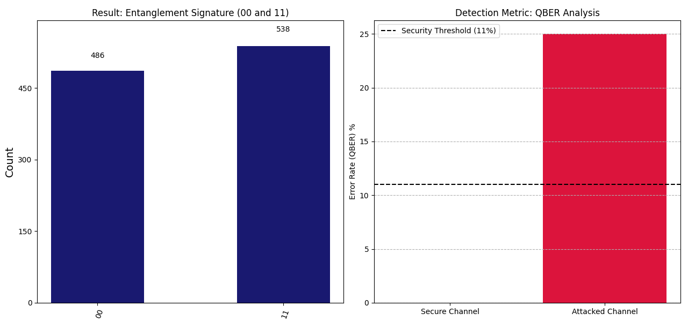

# Visualizing_No_Cloning
# Visualizing the No-Cloning Theorem 🛡️⚛️

**Theme:** Quantum Cryptography / Quantum Communication  

## 1. Problem Identification
In classical networks, data can be copied perfectly without leaving a trace. This project leverages the **No-Cloning Theorem**, which dictates that an unknown quantum state cannot be duplicated without physical disturbance, providing a "tamper-evident seal" for sensitive infrastructure like Aadhaar data.

## 2. Objective & Constraints
* **Objective:** Detect a simulated eavesdropping attempt by triggering a **25% Quantum Bit Error Rate (QBER)**.
* **Outcome:** Identify an attack when the error rate exceeds the **11% Security Threshold**.
* **Constraint:** States are prepared using non-orthogonal **H + P gates** to ensure they remain "unknown" to attackers.

## 3. Implementation Logic
* **Framework:** Qiskit Aer.
* **Process:** * **Alice:** Encodes a message with a Phase (pi/4) gate.
    * **Eve:** Attempts a cloning attack using a **CNOT gate**, creating entanglement instead of a copy.
    * **Audit:** Uses the **QSphere** and **Histograms** to analyze state integrity.

## 4. Experimental Results
### Entanglement Signature & QBER
Measurement yielded **530 counts of |00⟩** and **494 counts of |11⟩**. This 100% correlation proves the qubits are entangled.
* **Secure Channel:** 0% QBER.
* **Attacked Channel:** 25% QBER.

## 5. Conclusion & Future Work
The 25% QBER doubling the 11% threshold confirms that security is guaranteed by the laws of physics, not just mathematics.
* **Future Work:** Porting the circuit to **IBM Quantum hardware** to test decoherence impacts.
